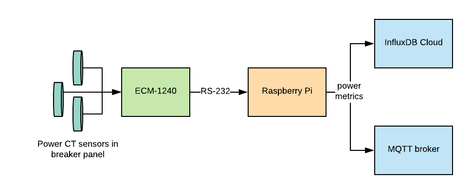

# Powermonitor - sensor
This golang app is the generates the metrics for the power monitoring infrastructure - it interfaces with the power measurement hardware and publishes either to a timeseries DB (currently InfluxDB cloud) or an MQTT broker for interested IOT consumers.

I've got this set up to run on an original Raspberry Pi Model A but it should run on any ARMv6,v7,v8 or x86-64 device running Linux. It reads voltage, energy usage, and current for 7 channels from a  [Brultech ECM-1240](https://www.brultech.com/ecm-1240/). It derives real-time power usage from these readings and outputs to an InfluxDB Cloud account or an MQTT broker.



This requires the ECM-1240 to be connected via RS-232 serial and exposed via a device file (in /dev). If using a cheap USB-to-RS232 dongle, it will typically be mounted as a device file named `/dev/ttyUSB` or similar.

A Raspberry Pi connected to an ECM-1240 monitor and the power breaker box it's measuring:

### Limitations
This is currently a barebones implementation to get some power measurements off a specific piece of hardware and a lot of this isn't reusable for other hardware without some modification. Additionally the "driver" for the ECM1240 is embedded into this app. Future improvements could separate this out into it's own golang library and make this app decoupled from the underlying hardware providing the power measurements.

### Building
All build and test related macros are defined in this app's [Makefile](Makefile).

To compile for an armv6 device (such as most Raspberry Pi 1 variants):
```shell script
make buildarm6
``` 

To compile for an armv7 and armv8 device (currently untested) ([Raspberry Pi 2,3,4](https://en.wikipedia.org/wiki/Raspberry_Pi#Specifications)). 
```shell script
make buildarm7
```
```shell script
make buildarm8
```

To compile for x86-64:
```shell script
make build
```
Running tests:
```shell script
make test
```

### Running
By default, the binary will be named `powermonitor`. It accepts input parameters in the form of environment variables: 
* `SERIALPATH` - serial device system filepath
* `ENABLEINFLUX` - write measurements to Influx Cloud
* `ENABLEMQTT` - write measurements to MQTT
* `INFLUXURL` - influx cloud URL
* `INFLUXTOKEN` - influx authentication token
* `INFLUXBUCKET` - influx metrics bucket
* `INFLUXORG` - influx org
* `MQTTURL` - MQTT broker URL e.g. "tcp://mqtt-hostname:1883"
* `MQTTTOPIC` - MQTT topic to publish to
* `MQTTUSER` - MQTT user
* `MQTTPASS` - MQTT password

Example usage:
```shell
export ENABLEINFLUX=true
export ENABLEMQTT=true
export SERIALPATH=/dev/ttyUSB0
export INFLUXBUCKET=power
export INFLUXORG="wang.andrew11@gmail.com"
export INFLUXTOKEN=foobar
export INFLUXURL=https://us-west-2-1.aws.cloud2.influxdata.com
export MQTTURL=tcp://mqtt:1883
export MQTTTOPIC=power
./powermonitor 
```
Logs - mostly just errors - are printed to `stderr`

### Deployment
No docker presently. My deployment strategy involves running and nohup-ing the binary via a shell script. `stderr` logging is redirected to a text file:
```shell script
nohup powermonitor <args lots of args> >logs.txt 2>&1 &
```

### Future improvements
As mentioned, it would be great for this to be dockerized for the obvious benefits: greater portability and more pleasurable deployment. This requires exposing a system device file to a running container.
